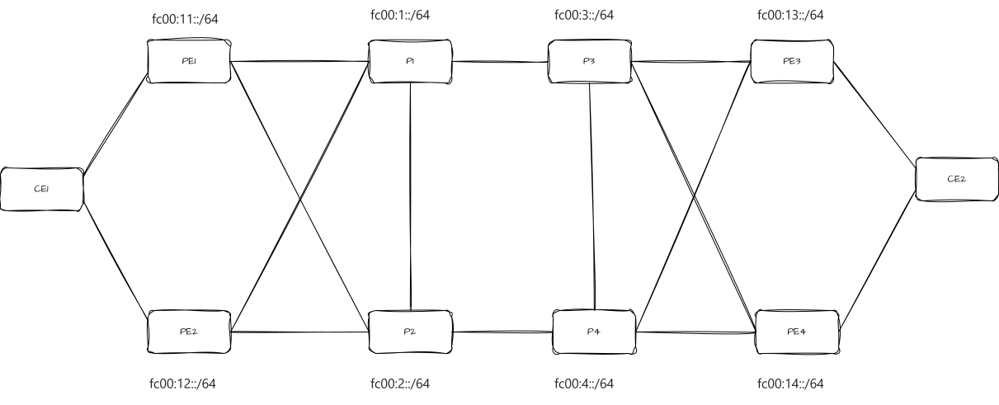
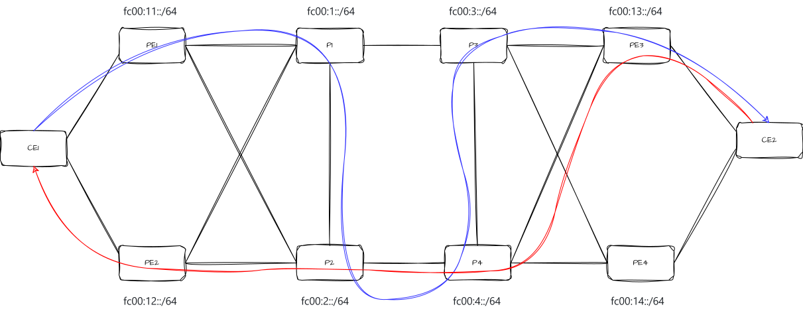

# te

2 CE, 4 PE, 4 P. IS-IS в underlay, BGP L3VPN поверх, одна VRF (RED),
CE подключены к двум PE каждый в active/active. Поверх этого — управление
трафиком: явный путь через ядро, заданный списком сегментов.

За каждым CE стоит хост с iperf3, счётчики всех интерфейсов пишутся
в VictoriaMetrics раз в 20 мс и смотрятся в Grafana, а контроллер показывает
текущую нагрузку прямо на схеме ядра.

Разворачивается одной командой:

```bash
bash setup.sh
```

Скрипт проверяет, умеет ли ядро seg6local, поднимает топологию, ждёт
сходимости IS-IS и BGP, проверяет мониторинг и показывает состояние. Погасить —
`sudo containerlab destroy -t srv6-lab2.clab.yml`.

После деплоя: контроллер на http://localhost:8080, Grafana на http://localhost:3000.

## Требования к ядру

Базовая часть (L3VPN, dual-homing) работает на любом ядре 5.11+
с `CONFIG_LWTUNNEL` и `CONFIG_IPV6_SEG6_LWTUNNEL`.

**Для TE нужно ядро 6.17 или новее.** На более старых End.X от isisd
установится в таблицу, но работать не будет — подробности ниже, в разделе
«Баг End.X». Под WSL2 это ветка `linux-msft-wsl-6.18.y`, сборка описана
в [basic/README.md](../basic/README.md), там же меняются только имя ветки
и имя выходного `bzImage`.

Проверить, что ядро подходит:

```bash
uname -r
sudo docker exec clab-srv6-lab2-p1 ip -6 route show | grep 'proto isis'
```

В строках End.X должен быть `oif`. Если его нет, ядро старое.

## Топология



На схеме 10 узлов и 16 линков: 12 в ядре и 4 на стыках с CE. Каждый PE подключён
к обоим своим P — PE1 и PE2 к P1 и P2, PE3 и PE4 к P3 и P4. Ядро связано
линками P1—P3 и P2—P4 (две плоскости) плюс P1—P2 и P3—P4 (поперечины).
CE1 висит на PE1 и PE2, CE2 — на PE3 и PE4, active/active.

Кроме того, в топологии, но не на схеме: хост h1 за CE1 и h2 за CE2
(`ce1:eth3 — h1:eth1`, `ce2:eth3 — h2:eth1`), контроллер `ctrl` и три узла
мониторинга — `collector`, `vm`, `grafana`. Узлы мониторинга живут только
в менеджмент-сети containerlab, линков в лабе у них нет.

## Адресация

| узел | loopback | локатор | NET |
|---|---|---|---|
| P1 | fc00::1 | fc00:1::/64 | 49.0000.0000.0000.0001.00 |
| P2 | fc00::2 | fc00:2::/64 | ...0002.00 |
| P3 | fc00::3 | fc00:3::/64 | ...0003.00 |
| P4 | fc00::4 | fc00:4::/64 | ...0004.00 |
| PE1 | fc00::11 | fc00:11::/64 | ...0011.00 |
| PE2 | fc00::12 | fc00:12::/64 | ...0012.00 |
| PE3 | fc00::13 | fc00:13::/64 | ...0013.00 |
| PE4 | fc00::14 | fc00:14::/64 | ...0014.00 |

Локаторы с разбивкой `block-len 40 node-len 24 func-bits 16`.

Линки ядра — привязка фиксированная, задана в `srv6-lab2.clab.yml`:

| подсеть | линк | интерфейсы |
|---|---|---|
| fc00:0:1::/64 | PE1 — P1 | pe1:eth1 — p1:eth1 |
| fc00:0:2::/64 | PE1 — P2 | pe1:eth2 — p2:eth1 |
| fc00:0:3::/64 | PE2 — P1 | pe2:eth1 — p1:eth2 |
| fc00:0:4::/64 | PE2 — P2 | pe2:eth2 — p2:eth2 |
| fc00:0:5::/64 | PE3 — P3 | pe3:eth1 — p3:eth1 |
| fc00:0:6::/64 | PE3 — P4 | pe3:eth2 — p4:eth1 |
| fc00:0:7::/64 | PE4 — P3 | pe4:eth1 — p3:eth2 |
| fc00:0:8::/64 | PE4 — P4 | pe4:eth2 — p4:eth2 |
| fc00:0:9::/64 | P1 — P3 | p1:eth3 — p3:eth3 |
| fc00:0:a::/64 | P2 — P4 | p2:eth3 — p4:eth3 |
| fc00:0:b::/64 | P1 — P2 | p1:eth4 — p2:eth4 |
| fc00:0:c::/64 | P3 — P4 | p3:eth4 — p4:eth4 |

Младший адрес в паре у узла, который в таблице слева.

Стыки CE-PE: `192.168.11.0/30` (CE1-PE1), `192.168.12.0/30` (CE1-PE2),
`192.168.23.0/30` (CE2-PE3), `192.168.24.0/30` (CE2-PE4). У PE всегда `.2`.
CE1 в AS 65001, CE2 в AS 65002, ядро в AS 65000.

Сети хостов: `10.1.0.0/24` за CE1 (CE1 `.1`, h1 `.2`) и `10.2.0.0/24` за CE2
(CE2 `.1`, h2 `.2`). CE отдаёт на PE по eBGP только сеть своего хоста:
`redistribute connected` через prefix-list `PL-HOSTS`. У хостов шлюз по
умолчанию — свой CE; это единственный маршрут, прописанный руками, и он на
конечном хосте, а не на роутере. MTU на хостах 1500: с запасом под
SRv6-инкапсуляцию в ядре, где MTU 9500.

## Control plane

IS-IS level-1, `topology ipv6-unicast`, SRv6-локатор на всех восьми узлах ядра —
включая P, которым локатор нужен не для VPN, а ради End и End.X под TE.

BGP L3VPN, адресное семейство VPNv4. Два route reflector'а, на **P1 и P3**,
по одному на площадку. 8 клиентских сессий: каждый PE держит сессию к обоим
рефлекторам. Сессии RR—RR нет: наборы клиентов у них совпадают, и в
установившемся режиме она ничего не добавляет.

RD привязан к номеру узла (`11:100`, `12:100`, …), RT общий — `65000:100`.
Разные RD обязательны: с одинаковым рефлектор схлопнул бы два пути в один,
и dual-homing перестал бы работать.

eBGP на стыках PE-CE, 4 сессии. `maximum-paths ibgp 4` в VRF на PE и
`maximum-paths 2` на CE дают active/active.

Статических маршрутов в конфигах нет, `staticd=no` везде — хотя в образе FRR
staticd всё равно стартует, и именно через него ставится TE-маршрут.

## Управление трафиком

### Чего в FRR нет

Штатной ручки «задай явный путь для SRv6» в FRR 10.7 не существует.

Остаётся `ip route ... segments` в staticd. Этого достаточно: список сегментов
описывает путь целиком, а транзитным узлам остаётся исполнять End.X.

### Как задать путь

Пример: провести трафик CE1 → CE2 по маршруту PE1 → P1 → P2 → P4 → P3 → PE3,
в обратную сторону оставить bestpath.

Нужны три adjacency-SID (End.X) и один DT4-сид:

| узел | нужный сосед | сид |
|---|---|---|
| P1 | P2 (eth4) | End.X |
| P2 | P4 (eth3) | End.X |
| P4 | P3 (eth4) | End.X |
| PE3 | — | End.DT4 для VRF RED |

Четырёх сегментов хватает: после `fc00:4:0:0:2::` пакет попадает к P3, и тот
доносит его до DT4-сида PE3 обычной маршрутизацией. Пятый сегмент (End.X у P3
в сторону PE3) избыточен.



Обратный трафик по этому пути не идёт. PE3 отправляет ответ с единственным
сегментом — DT4-сидом дальнего PE, — и маршрут до него строит IS-IS, то есть
это обычный VPN, а не TE. В нашем случае ответ уходит PE3 → P4 → P2 → PE2
и дальше на CE1: другая точка входа, другой набор узлов. Асимметрия здесь
намеренная, она и показывает, что явный путь работает только там, где задан.

**Номера функций в сидах плавают между передеплоями.** Привязка интерфейсов
к соседям фиксирована в topology-файле, а вот какой номер isisd выдаст каждому
End.X — зависит от порядка, в котором поднялись соседства. Поэтому зашивать
`fc00:1:0:0:4::` в конфиг нельзя: после следующего `setup.sh` этот сид может
указывать в другую сторону, и трафик молча уйдёт не туда.

Готовый скрипт собирает сеглист сам:

```bash
bash te/te-path.sh
```

Он читает `show segment-routing srv6 sid` и `show isis neighbor` на каждом
транзитном узле, сшивает их и ставит маршрут на PE1. Путь задаётся переменной
`PATH_NODES`, по умолчанию `p1 p2 p4 p3`.

Вручную то же самое:

```bash
# на каждом транзитном узле — какой SID смотрит на нужного соседа
sudo docker exec clab-srv6-lab2-p1 vtysh -c "show segment-routing srv6 sid"
sudo docker exec clab-srv6-lab2-p1 vtysh -c "show isis neighbor"

# DT4-сид на дальнем PE
sudo docker exec clab-srv6-lab2-pe3 vtysh -c "show segment-routing srv6 sid" | grep DT4

# маршрут
sudo docker exec clab-srv6-lab2-pe1 vtysh -c "conf t" \
  -c "ip route 10.2.0.0/24 eth3 segments <P1>/<P2>/<P4>/<DT4 PE3> vrf RED"
```

### Как проверить, что путь тот

Пинг сам по себе ничего не доказывает: он проходил и до настройки TE. Нужен
дамп по интерфейсам.

```bash
bash te/capture.sh
```

Скрипт снимает трафик на каждом интерфейсе каждого узла в отдельный pcap,
прогоняет пинг и печатает сводку. Оба скрипта можно запускать из корня
репозитория — пути внутри не зависят от текущего каталога. Файлы пишутся
в `te/pcap/`, он в `.gitignore`. Файлы пишутся с Ethernet link-type, поэтому
открываются любым Wireshark; захват через `-i any` даёт LINUX_SLL2, который
понимают только версии 3.6+.

Правильная картина выглядит так:

```
p1-eth1  IP6 fc00::11 > fc00:1:0:0:4:: RT6 (segleft=3, ...)
p1-eth4  IP6 fc00::11 > fc00:2:0:0:3:: RT6 (segleft=2, ...)
```

Вход и выход на **разных** интерфейсах, segleft уменьшается на каждом узле.
Если вход и выход на одном интерфейсе — сеглист собран из неверных сидов,
пакет разворачивается назад и доходит до цели обычной маршрутизацией, а не
по заданному пути.


## Баг End.X с link-local next-hop

Исторически главная засада этой лабы, теперь закрытая. Стоит знать, потому что
на ядрах старше 6.17 она воспроизводится целиком.

**Симптом.** TE-маршрут установлен, End.X в таблице ядра есть, пакеты молча
теряются. Диагностики никакой: ошибок нет, счётчики пустые, `ip -6 route get`
показывает правильный интерфейс. В дампе на транзитном узле видно, что он ищет
соседа не на том интерфейсе:

```
eth1 In  IP6 fc00::11 > fc00:1:0:0:3:: RT6 (segleft=4, ...)
eth1 Out ICMP6, neighbor solicitation, who has fe80::a8c1:abff:feb9:19a1
eth1 Out ICMP6, destination unreachable, unreachable address fc00:2:0:0:1::
```

Solicitation уходит во входящий интерфейс, хотя сосед живёт на другом.
В `ip -6 neigh` при этом две записи на один адрес: на правильном интерфейсе
разрешён, на входящем — FAILED.

**Причина.** `input_action_end_x_finish()` в `net/ipv6/seg6_local.c` не передавал
выходной интерфейс в поиск next-hop, а внутри поиск шёл по `flowi6_iif`.
С глобальным next-hop это неважно, интерфейс для разрешения не нужен;
с link-local — ломается. isisd ставит именно link-local, потому что берёт адрес
из IS-IS-соседства, и повлиять на это нельзя: в `router isis / segment-routing srv6`
есть только `interface`, `locator` и `node-msd`.

Баг ровесник самого seg6local, `Fixes: 140f04c33bbc`. [Патч Reji Thomas
2020 года](https://lkml.iu.edu/hypermail/linux/kernel/2010.1/07190.html)
не приняли: сделать OIF обязательным атрибутом означало отвергнуть все
существующие конфигурации End.X без него.

**Починено** в июне 2025, Ido Schimmel, три коммита — `01c411238c06`,
`3159671855d4`, `a2840d4e2527`. OIF сделан опциональным атрибутом. Вошло в 6.17.

**FRR при этом всегда был прав.** zebra ставит `SEG6_LOCAL_OIF` безусловно
(`zebra/rt_netlink.c`), а isisd честно заполняет ifindex интерфейсом соседства
(`isisd/isis_srv6.c:143`). Старое ядро атрибут просто игнорировало: в его таблице
behaviors у End.X `OIF` не значился ни обязательным, ни опциональным, а разбор
идёт перебором только по разрешённым атрибутам. Обе стороны вели себя корректно,
пакеты исчезали, диагностики ноль.

**Обход для старых ядер** — свои сиды с глобальным next-hop вместо link-local:

```
segment-routing
 srv6
  static-sids
   sid fc00:1:0:0:e3::/80 locator MAIN behavior uA interface eth4 nexthop fc00:0:b::2
  exit
 exit
exit
```

Номер функции брать заведомо больше тех, что занимает isisd, иначе конфликт.
FRR прицепляет к `uA` флаг `next-csid`; при нулевом аргументе в адресе поведение
схлопывается в обычный End.X, так что на списке из /80-сегментов это не мешает.
На 6.17+ обход не нужен.

## Контроллер

Нода `ctrl`: bgpd без IS-IS, два линка до P1 и P3 (`fc00:0:d::/64`, `fc00:0:e::/64`).
Сессии поднимаются на адресах линков, в двух address-family. Link-state приносит
топологию ядра: узлы с именами, локаторы, End и End.X, причём каждое направление
линка — отдельная запись со своим сидом. VPNv4 приносит префиксы от PE с их
DT4-сидами, так что контроллеру не нужен ни IGP, ни доступ к узлам по SSH.

На той же ноде — веб-интерфейс, `te/ctrl/app`, порт 8080 проброшен на хост.
Топологию и выходные PE он читает через `vtysh` локально, а маршрут ставит на
выбранные PE через Docker API по проброшенному `/var/run/docker.sock`: та же
команда `ip route ... segments ... vrf RED`, что и в `te-path.sh`, только сеглист
собирается из кликов по схеме.

Открыть `http://localhost:8080`, ввести префикс (`10.2.0.0/24`), выбрать выходной PE,
набрать путь кликами по стрелкам, отметить входные PE, нажать Commit. Шаги не обязаны
быть смежными: до первого выбранного линка пакет идёт по IGP. Проверять — `bash te/capture.sh`
или по нагрузке на схеме.

**Нагрузка на схеме.** Раз в секунду контроллер берёт у сборщика скорость по каждому
направлению линка за последнюю секунду: у каждой стрелки полоса, толщина которой
растёт с нагрузкой, и подпись в бит/с (`95.0M`). Служебный трафик IS-IS и BGP
(меньше 100 кбит/с) не показывается. Под схемой — самый загруженный линк. Так видно,
какой узел и какой линк реально несут трафик, до того как что-то выключать.

## Трафик: iperf3

На хостах образ `nicolaka/netshoot`, iperf3 в нём есть.

Для тестов удобнее постоянный фоновый поток, который включается и выключается
одной командой:

```bash
bash te/traffic.sh start           # UDP 100 Мбит/с h1 -> h2, пока не остановишь
bash te/traffic.sh log             # интервалы сервера по 100 мс, выход Ctrl+C
bash te/traffic.sh status
bash te/traffic.sh stop            # остановить и показать итог: сколько потеряно
RATE=300M bash te/traffic.sh start
PROTO=tcp bash te/traffic.sh start # 4 TCP-потока, STREAMS=8 для восьми
```

Оба iperf3 работают внутри контейнеров, терминал не занимают. Лог сервера —
`/tmp/iperf-server.log` в h2.

Руками то же самое: сервер запускать в отдельном терминале, в UDP потери
по интервалам показывает именно он.

```bash
sudo docker exec -it clab-srv6-lab2-h2 iperf3 -s -i 0.1
```

UDP, 100 Мбит/с, 60 секунд, отчёт каждые 100 мс:

```bash
sudo docker exec -it clab-srv6-lab2-h1 iperf3 -c 10.2.0.2 -u -b 100M -t 60 -i 0.1
```

TCP в 4 потока — чтобы нагрузка разошлась по обоим PE:

```bash
sudo docker exec -it clab-srv6-lab2-h1 iperf3 -c 10.2.0.2 -P 4 -t 60
```

Один поток всегда идёт через один PE: ECMP хэширует поток целиком. Чтобы потоки
с разными портами расходились, во всех узлах включён
`net.ipv4.fib_multipath_hash_policy=1` (хэш по L4).

Для измерения потерь лучше UDP. TCP сам повторяет потерянное, а пакеты большие
(GSO), поэтому счётчики пакетов для него почти ничего не говорят.

## Мониторинг

```
/proc/<PID>/net/dev ──► collector ──► VictoriaMetrics ──► Grafana
                           │
                           └── /rates ──► схема в контроллере
```

**Сборщик** (`te/monitoring/collector/collector.py`, узел `collector`) раз в 20 мс
читает `/proc/<PID>/net/dev` всех контейнеров лабы через смонтированный хостовый
`/proc`: этот файл показывает счётчики сетевого namespace процесса с таким PID,
так что ни агентов в узлах, ни `docker exec` не нужно. Контейнеры он находит через
Docker API по имени и перечитывает раз в 5 секунд, поэтому передеплой подхватывает
сам. Соседа на другом конце каждого интерфейса берёт из `srv6-lab2.clab.yml`.
Раз в секунду отправляет накопленное в VictoriaMetrics с метками времени
в миллисекундах. Только стандартная библиотека Python, образ — тот же FRR.
Лог — `te/monitoring/collector/collector.log`.

Метрики: `lab_if_rx_bytes_total`, `lab_if_tx_bytes_total`, `lab_if_rx_packets_total`,
`lab_if_tx_packets_total`, метки `node`, `iface`, `peer`. Собираются только `eth1` и
дальше, менеджмент `eth0` и `lo` — нет.

**VictoriaMetrics** (узел `vm`, порт 8428 проброшен на хост) хранит данные 7 дней
в `te/monitoring/data/`. Каталог в `.gitignore`, `destroy` его не трогает, поэтому
графики прошлых тестов остаются между передеплоями. Файлы в нём создаёт контейнер
от root: удалять через `sudo rm -rf te/monitoring/data`.

**Grafana** (узел `grafana`, http://localhost:3000, вход без пароля) поднимается
с источником данных и дашбордом из `te/monitoring/grafana/`. На дашборде:

- линки ядра — бит/с по каждому направлению, таблица справа сортируется по максимуму;
- потери между хостами — сколько пакетов в секунду отправлено и не получено;
  во время перестроения здесь всплеск, его площадь — число потерянных пакетов;
- хосты — отправлено и получено;
- стыки CE — PE — через какой PE трафик вошёл в ядро и вышел из него;
- линки ядра в пакетах.

Разбор после теста: выделить мышью участок вокруг отказа и приближать. Точки в базе
идут раз в 20 мс, и минимальный интервал панелей такой же, так что провал видно
с этой точностью. Минимальный период автообновления дашборда — 1 секунда.

Время на графиках — часы WSL. Если после сна Windows они отстали, свежие точки
окажутся «в прошлом» и график будет обрываться раньше, чем надо: `sudo hwclock -s`.
